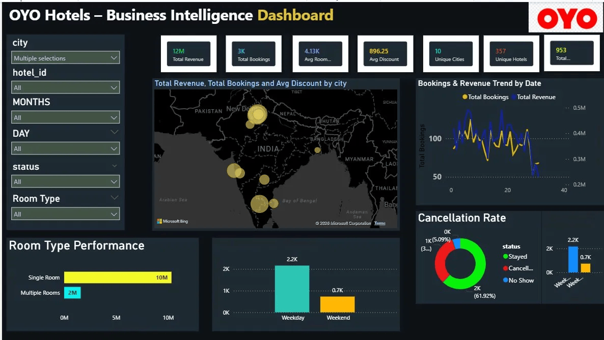

# 🏨 OYO Hotel Booking Analysis — SQL + Power BI Project

## 📌 Overview
A complete data analysis project on OYO hotel bookings combining SQL for data exploration
and Power BI for interactive business intelligence dashboard. The project covers:
- City-wise hotel and revenue distribution
- Booking & cancellation trend analysis
- Room type performance (Single vs Multiple)
- Weekday vs Weekend booking patterns
- Customer behavior and discount analysis

## 📂 Dataset
| Table | Description |
|-------|-------------|
| oyo_city | Hotel and city mapping data |
| oyo_sales1 | Booking transactions (2891 records) |

## 📊 Key Metrics (from Dashboard)
| Metric | Value |
|--------|-------|
| 💰 Total Revenue | ₹12 Million |
| 📋 Total Bookings | 3,000+ |
| 🛏️ Avg Room Rate | ₹4,130 per booking |
| 🏷️ Avg Discount | ₹896.25 |
| 🌆 Unique Cities | 10 |
| 🏨 Unique Hotels | 357 |

## 📈 Key Insights
- **Room Type:** Single Room dominates with ₹10M revenue vs ₹2M for Multiple Rooms
- **Booking Pattern:** Weekdays see significantly more bookings (2.2K) than Weekends (0.7K)
- **Stay Rate:** ~61.92% of bookings resulted in confirmed stays
- **Cancellation & No Shows:** Tracked separately across weekday and weekend patterns
- **Geo Distribution:** Revenue and bookings spread across 10 major Indian cities shown on interactive map

## 🛠️ SQL Analysis (14 Problems Solved)
1. Basic EDA — Total records, Hotels & Cities
2. Number of hotels per city
3. Average room rates by city
4. Cancellation rates by city
5. Bookings in Jan, Feb, Mar months
6. Total bookings & average rooms per booking
7. Top 5 cities by bookings
8. Booking status distribution (Confirmed / Cancelled / No Show)
9. Total revenue and discount per hotel
10. Revenue and discount percentage per city
11. Single Room vs Multiple Room bookings
12. Average length of stay (in days)
13. Top 10 customers by booking count
14. Average discount percentage across all bookings

## 📊 Power BI Dashboard Features
- **KPI Cards** — Total Revenue, Total Bookings, Avg Room Rate, Avg Discount, Cities, Hotels
- **Geospatial Map** — Revenue & Bookings bubble map across Indian cities
- **Bookings & Revenue Trend** — Date-wise dual axis trend chart
- **Room Type Performance** — Single vs Multiple room revenue bar chart
- **Weekday vs Weekend** — Booking volume comparison
- **Cancellation Rate** — Donut chart with Stayed / Cancelled / No Show breakdown
- **Slicers** — City, Hotel ID, Month, Day, Status, Room Type filters

## 🖼️ Dashboard Preview

## 🔧 Tools Used
- **MySQL** — Data exploration and problem solving (14 queries)
- **Microsoft Power BI** — Interactive business intelligence dashboard
- **Microsoft Excel** — Raw dataset (oyo_city, oyo_sales)

## 📚 What I Learned
- Writing complex SQL queries using JOINs, GROUP BY, CTEs, and aggregate functions
- Connecting SQL data to Power BI for visualization
- Building interactive dashboards with slicers and KPI cards
- Geospatial mapping in Power BI using Bing Maps
- Deriving business insights from hotel booking transactional data
